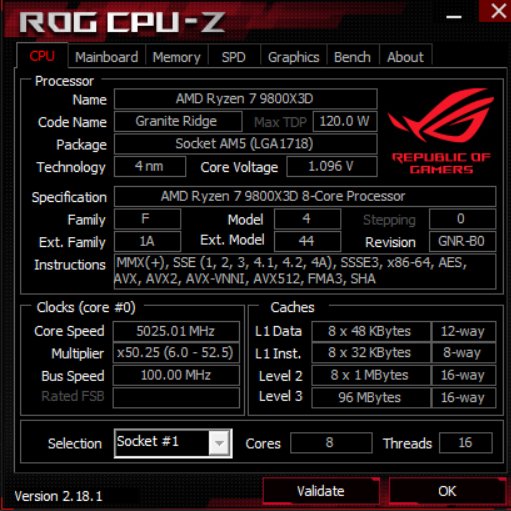
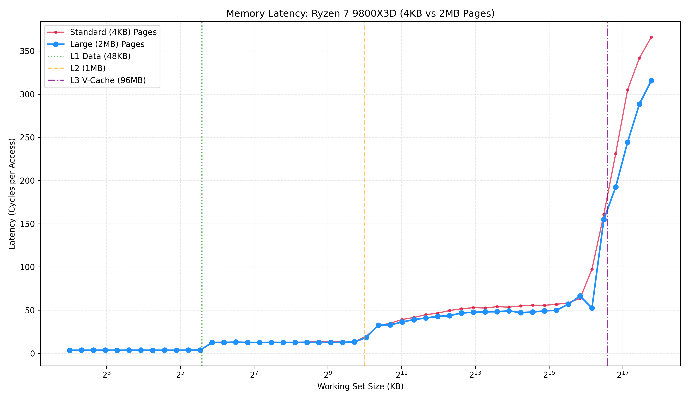
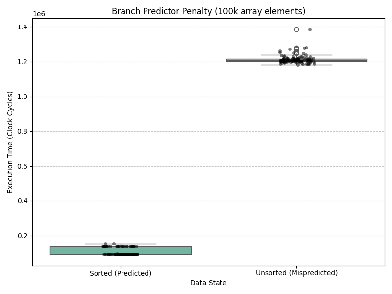
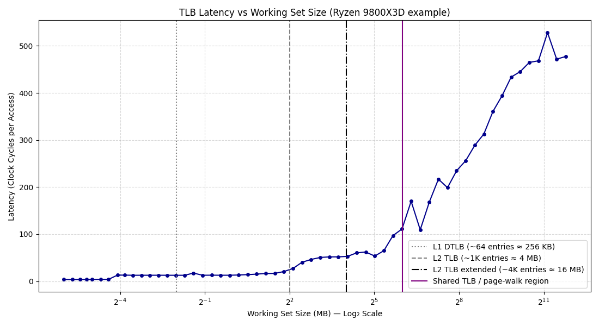
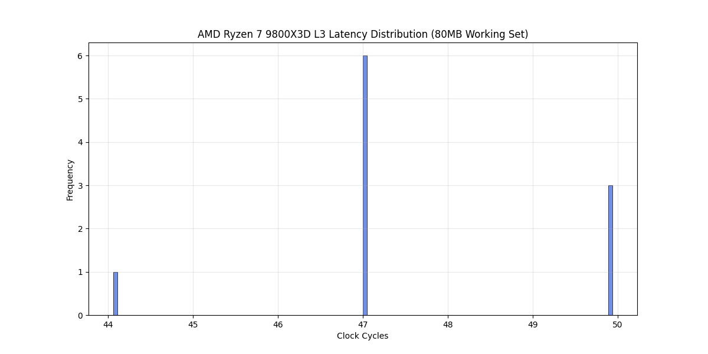
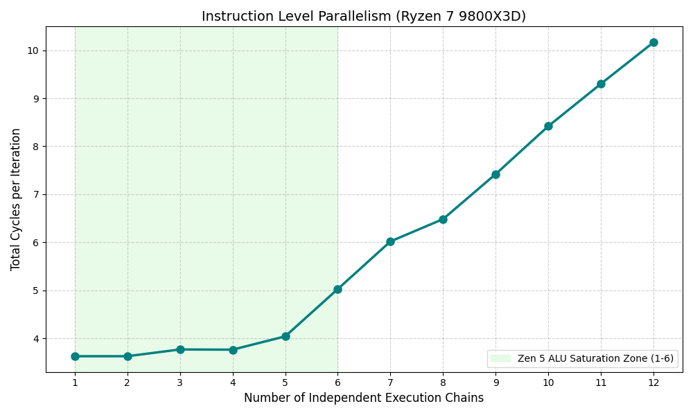

# CPU Microarchitecture Benchmark Suite

I keep on reading things like "L1 data cache access times are 10-20ns." under which conditions, warm/cold, how did they measure it,...
and similar claims but what about my machine?
I used C++23, Google benchmark and RDTSC cycle counting for the measurements. My CPU is a AMD Ryzen 7 9800X3D (Zen 5).

## Organisation

- **`src/`** –  C++ benchmarks
- **`data/`** – CSV samples.
- **`python/`** – Plotting scripts
- **`plots/`** – The resulting graphs.

## Benchmarks 

### 0. CPU specification.
Below the Cache sizes and CPU specifications I used:



### 1. Cache hierarchy latency
We walk a random‑order pointer chain to avoid the prefetcher and measure L1/L2/L3 reads.


Plotting only the red line at first, I was a bit confused. Why are access times for L3 cache not uniform? Given the range $2^{13}$ KB (8MB) to $2^{14}$ KB (16MB) matches the TLB size, I suspected these are due to TLB misses.
Using 4KB pages and around 3000-4000 entries in L2 TLB, we can only map 12 MB of memory. So I pinned huge pages (2GB) in memory and tried again:




### 2. Branch prediction & speculation
Compares sorted vs. shuffled data to force real branch instructions. 

Modeling Note: Modern compilers often attempt to use CMOV (Conditional Move) to avoid branches.
I used benchmark::DoNotOptimize within conditional blocks to avoid this.



### 3. L3 latency & TLB thrashing
Every single memory access is timed with `RDTSC` + `_mm_lfence`.  

### 4. 3D V‑Cache performance
AMD's patent for "Balanced Latency stacked cache" (https://patents.google.com/patent/US20260003794A1/en), claims near‑perfect, single‑spike latency distribution due to the 9800X3D’s “flipped” design (CCD on top of the cache).
I checked and it looks like they are right! (We can see this in the above cache sweep image too.)

### 5. False Sharing 
Measuring the impact of false sharing, not much to say here. See speedup table below.

### 6. Instruction Level parallelism (ILP) & Dependency Chains
Two benchmarks: ILP_Dependent tests the raw latency of the CPU's ALUs by making each instruction wait for the previous one, and ILP_Independent visualizes the speedup gained by Out-of-Order execution and ILP.

From what I read, the Zen 5 architecture should have 6 ALUs (https://chipsandcheese.com/p/zen-5s-leaked-slides), but our graph starts sloping upward at 5 instead of staying flat through 6.



It must be that those 6 ALUs are not identical. Our ILP_Independent benchmark uses a Xorshift sequence (x ^= (x << 13); x ^= (x >> 7)) to prevent the compiler from cheating. This operation relies heavily on bit shifts.

While Zen 5 can dispatch simple additions to all 6 Integer ALUs, complex hardware like barrel shifters (required for << and >>) are may not be duplicated across every single port  
due to the massive area and power requirements of the register file routing. Our graph proves that we are hitting a physical throughput bottleneck 
on Zen 5's dedicated shift units right at that 5-chain mark, bottlenecking the core before we can fully saturate the theoretical 6-ALU width. 

| Benchmark | Strategy | Latency (Avg) | Throughput | Speedup |
| :--- | :--- | :--- | :--- | :--- |
| **ILP** | Dependent Chains | 3749 ns | 2.67 G/s | 1.0x (Baseline) |
| **ILP** | **Independent (6+ ALUs)** | **725 ns** | **27.57 G/s** | **10.3x faster** |
| **Coherency** | False Sharing (Packed) | 12.83 ms | 155.8 M/s | 1.0x (Baseline) |
| **Coherency** | **Cache-Aligned (64B)** | **3.84 ms** | **520.7 M/s** | **3.3x faster** |

### Benchmark output:

[//]: # (<details>)

[//]: # (<summary><b>View Raw Benchmark Output</b></summary>)

[//]: # ()
```
Run on (16 X 4700 MHz CPU s)
CPU Caches:
L1 Data 48 KiB (x8)
L1 Instruction 32 KiB (x8)
L2 Unified 1024 KiB (x8)
L3 Unified 98304 KiB (x1)
--------------------------------------------------------------------------------------
Benchmark                     Time             CPU   Iterations UserCounters...
--------------------------------------------------------------------------------------
ILP_Dependent              3849 ns         3749 ns       179200 items_per_second=2.66716G/s
ILP_Independent             721 ns          725 ns      1120000 items_per_second=27.5692G/s
FalseSharing_Conflict  13406570 ns     12834821 ns           56 items_per_second=155.826M/s
FalseSharing_Aligned    3880062 ns      3840782 ns          179 items_per_second=520.727M/s
BM_BranchPrediction/0     59282 ns        58594 ns        11200
BM_BranchPrediction/1     51594 ns        51618 ns        11200
TLB_Walk                4342550 ns      4360465 ns          172 items_per_second=120.237M/s
BM_CacheHierarchy/4096     0.768 ns        0.781 ns   1120000000
BM_CacheHierarchy/8192     0.766 ns        0.767 ns    896000000
BM_CacheHierarchy/16384    0.765 ns        0.767 ns   1120000000
BM_CacheHierarchy/32768    0.769 ns        0.767 ns    896000000
BM_CacheHierarchy/65536     2.68 ns         2.67 ns    263529412
BM_CacheHierarchy/131072    2.68 ns         2.57 ns    248888889
BM_CacheHierarchy/262144    2.68 ns         2.73 ns    263529412
BM_CacheHierarchy/524288    2.69 ns         2.61 ns    263529412
BM_CacheHierarchy/1048576   3.87 ns         3.84 ns    235789474
BM_CacheHierarchy/2097152   8.03 ns         7.85 ns     89600000
BM_CacheHierarchy/4194304   9.88 ns         10.0 ns     74666667
BM_CacheHierarchy/8388608   11.0 ns         11.0 ns     64000000
BM_CacheHierarchy/16777216  12.6 ns         12.3 ns     56000000
BM_CacheHierarchy/33554432  18.8 ns         19.0 ns     34461538
BM_CacheHierarchy/67108864  37.9 ns         38.4 ns     17920000
BM_CacheHierarchy/134217728 58.5 ns         57.5 ns      8960000
BM_CacheHierarchy/268435456 82.5 ns         82.0 ns      8960000
```

[//]: # (</details>)

## Build & run

**Requirements**
- C++23 compiler (GCC 13+ or Clang 16+)
- CMake 3.31+
- Google Benchmark
- Python 3.10+ with `pandas`, `matplotlib`, `seaborn`
- must have group protocols enabled (bat file provided)

**Build**
```bash
mkdir build && cd build
cmake .. -DCMAKE_BUILD_TYPE=Release
cmake --build .
